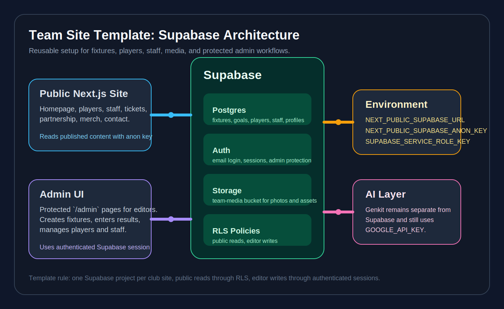

# 03. Next.js Integration

This repo now ships with a Supabase client layer, login page, and `/admin` middleware protection. Use this document to understand how the template is wired and what each new team still needs to provide in its own Supabase project.

## 1. Create The Browser Client

`src/lib/supabase/client.ts`

```ts
import { createBrowserClient } from "@supabase/ssr";

export function createClient() {
  return createBrowserClient(
    process.env.NEXT_PUBLIC_SUPABASE_URL!,
    process.env.NEXT_PUBLIC_SUPABASE_ANON_KEY!
  );
}
```

## 2. Create The Server Client

`src/lib/supabase/server.ts`

```ts
import { createServerClient } from "@supabase/ssr";
import { cookies } from "next/headers";

export async function createClient() {
  const cookieStore = await cookies();

  return createServerClient(
    process.env.NEXT_PUBLIC_SUPABASE_URL!,
    process.env.NEXT_PUBLIC_SUPABASE_ANON_KEY!,
    {
      cookies: {
        getAll() {
          return cookieStore.getAll();
        },
        setAll(cookiesToSet) {
          cookiesToSet.forEach(({ name, value, options }) =>
            cookieStore.set(name, value, options)
          );
        },
      },
    }
  );
}
```

## 3. Protect `/admin`

Recommended middleware shape:

`src/middleware.ts`

```ts
import { NextResponse, type NextRequest } from "next/server";
import { createServerClient } from "@supabase/ssr";

export async function middleware(request: NextRequest) {
  let response = NextResponse.next({
    request: {
      headers: request.headers,
    },
  });

  const supabase = createServerClient(
    process.env.NEXT_PUBLIC_SUPABASE_URL!,
    process.env.NEXT_PUBLIC_SUPABASE_ANON_KEY!,
    {
      cookies: {
        getAll() {
          return request.cookies.getAll();
        },
        setAll(cookiesToSet) {
          cookiesToSet.forEach(({ name, value, options }) => {
            request.cookies.set(name, value);
            response.cookies.set(name, value, options);
          });
        },
      },
    }
  );

  const {
    data: { user },
  } = await supabase.auth.getUser();

  if (!user && request.nextUrl.pathname.startsWith("/admin")) {
    return NextResponse.redirect(new URL("/", request.url));
  }

  return response;
}

export const config = {
  matcher: ["/admin/:path*"],
};
```

## 4. Admin Data Integration Status

Current file:
- `src/app/admin/page.tsx`

Current state:
- reads from Supabase when env vars and tables are available
- writes fixtures, results, players, and staff through the browser client with RLS
- falls back to demo data if Supabase is not configured yet

Recommended next improvements:

1. Move public page reads from placeholder data into Supabase-backed queries.
2. Add edit forms for existing rows, not just create and delete flows.
3. Move media uploads from plain URL input to Supabase Storage.
4. Add `site_settings` reads so rebranding becomes database-driven.

## 5. Suggested Query Mapping

Public homepage:
- read latest completed fixture
- read next upcoming fixture
- read featured players or staff

Players page:
- select all active players ordered by squad number or name

Staff page:
- select all active staff ordered by role

Admin page:
- list fixtures
- insert fixtures
- update results
- list players and staff
- insert, update, delete players and staff

## 6. Recommended Type Generation

Generate database types after schema changes:

```bash
npx supabase gen types typescript --project-id YOUR_PROJECT_ID --schema public > src/types/database.ts
```

Then wire those generated types into your client wrappers.

## 7. Add A Simple Upload Convention

For image uploads:

```text
team-media/players/{player-id}.jpg
team-media/staff/{staff-id}.jpg
team-media/branding/{asset-name}.png
```

This keeps URLs predictable and migration scripts simpler.

## 8. Keep Service Role Usage Narrow

Use `SUPABASE_SERVICE_ROLE_KEY` only for:
- seed scripts
- server-only migrations
- admin bootstrap tasks

Do not expose it to the browser.

## 9. AI Features Still Need Google

This template already uses Genkit in:
- `src/ai/genkit.ts`
- `src/ai/flows/automated-match-summaries.ts`

Supabase handles data and auth.
Genkit still needs:

```bash
GOOGLE_API_KEY=
```

## 10. Diagram


