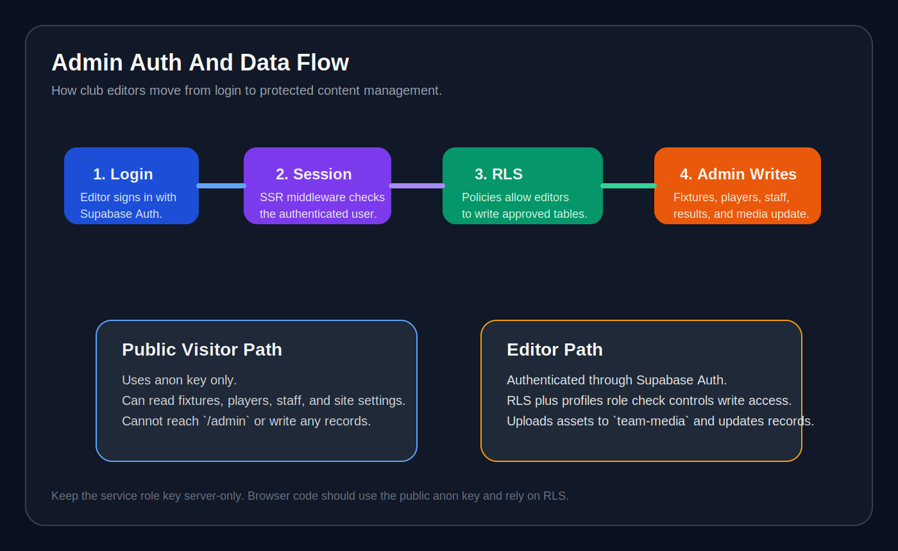

# Supabase Setup Guide

This folder turns the current repo into a reusable team-site template.

The app already has the right content model for a club website:
- fixtures and results
- players
- staff
- admin editing flows

What it does not have yet is a production database and auth layer. These docs show each team how to connect the template to its own Supabase project without having to reverse-engineer the repo.

## Read In This Order

1. [01-project-setup.md](./01-project-setup.md)
2. [02-schema-and-rls.md](./02-schema-and-rls.md)
3. [03-nextjs-integration.md](./03-nextjs-integration.md)
4. [04-team-launch-checklist.md](./04-team-launch-checklist.md)

## Diagrams

### Supabase Architecture


### Admin Auth And Data Flow



## What This Template Assumes

- Each club creates its own Supabase project.
- Public visitors can read published content.
- Club admins sign in and manage content through `/admin`.
- Supabase Storage holds team images such as player headshots, staff photos, sponsor logos, and optional hero media.
- AI features still use the existing Genkit setup, so `GOOGLE_API_KEY` remains part of the environment.

## Recommended Environment Variables

```bash
NEXT_PUBLIC_SUPABASE_URL=
NEXT_PUBLIC_SUPABASE_ANON_KEY=
SUPABASE_SERVICE_ROLE_KEY=
SUPABASE_JWT_SECRET=
GOOGLE_API_KEY=
```

`SUPABASE_SERVICE_ROLE_KEY` should only be used server-side.

## Current Repo Status

The repo now ships with:
- Supabase browser and server client helpers
- middleware-based `/admin` protection
- a `/login` page backed by Supabase Auth
- an admin dashboard that will read and write real Supabase data once the documented tables exist

The dashboard also keeps a local demo fallback when env vars or tables are missing, so teams can still explore the template before wiring their own project.
