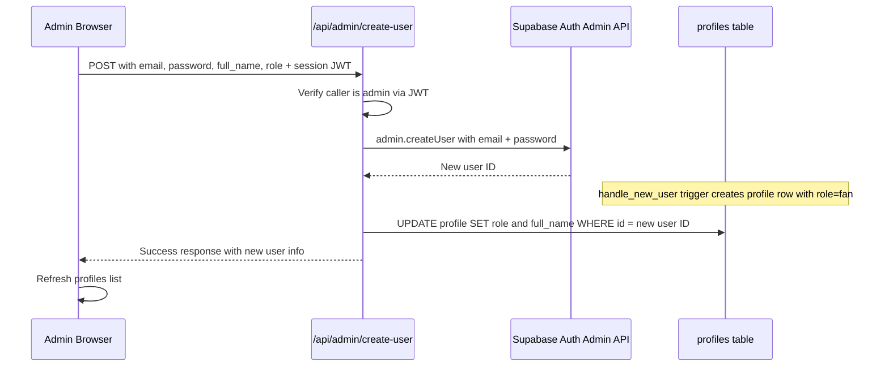

# Plan: Admin Create New Accounts from Dashboard

## Summary

Enable admins to create new user accounts of all types (admin, club, creator, player, fan) directly from the User Management section of the dashboard.

## Problem

The current [`UserManagementSection`](src/app/dashboard/components/user-management-section.tsx) only allows changing roles of existing users. There is no UI or backend endpoint for creating new accounts.

## Key Constraint

Creating Supabase Auth users requires `supabase.auth.admin.createUser()`, which needs the **service role key**. This key must **never** be exposed to the browser. Therefore, we need a **server-side API route** that acts as a secure proxy.

## Architecture

## Files to Create/Modify

### 1. NEW: `src/app/api/admin/create-user/route.ts`

A Next.js App Router API route that:

- **Accepts**: `POST` with JSON body `{ email, password, full_name, role }`
- **Authenticates**: Verifies the caller's JWT from the `Authorization` header or cookies to confirm they are an admin
- **Creates user**: Uses `supabase.auth.admin.createUser()` with the service role key
- **Updates profile**: After the `handle_new_user` trigger creates the default profile row, updates it with the correct `role` and `full_name`
- **Returns**: `{ success: true, user: { id, email } }` or `{ error: string }`

Key implementation details:
- Uses `@supabase/ssr` `createServerClient` with the `SUPABASE_SERVICE_ROLE_KEY` for admin operations
- Validates the caller's session using the anon key client first
- Checks that the caller's profile has `role = 'admin'`
- Validates input: email format, password strength (min 6 chars), role must be one of the 5 allowed values
- Sets `email_confirm: true` so the new user can sign in immediately without email verification

### 2. MODIFY: `src/app/dashboard/components/user-management-section.tsx`

Add a **Create New User** dialog with:

- A **UserPlus** button at the top of the section
- A **Dialog** component (already available in `src/components/ui/dialog.tsx`) containing:
  - Email input (required)
  - Password input (required, min 6 chars)
  - Full Name input (optional)
  - Role selector dropdown with all 5 roles: Admin, Club Staff, Content Creator, Player, Fan
  - Submit button with loading state
- On submit: calls `fetch('/api/admin/create-user', ...)` with the session access token
- On success: calls `onRefresh()` callback to reload the profiles list
- On error: displays error message in the dialog

### 3. MODIFY: `src/app/dashboard/page.tsx`

Minor update to pass an `onRefresh` callback to `UserManagementSection`:

- Pass `onRefresh={() => refreshFromSupabase()}` prop to `UserManagementSection`
- This allows the section to trigger a full data refresh after creating a user

### 4. MODIFY: `src/app/dashboard/components/user-management-section.tsx` Props

Update the `Props` type to accept:
- `onRefresh: () => void` — callback to refresh all data from Supabase

## Data Flow

1. Admin clicks **Create New User** button in User Management section
2. Dialog opens with form fields
3. Admin fills in email, password, full name, and selects a role
4. On submit, the client sends a `POST` request to `/api/admin/create-user` with:
   - The form data in the JSON body
   - The current session's access token in the `Authorization: Bearer <token>` header
5. The API route:
   - Creates a Supabase server client with the anon key to verify the caller's session
   - Checks the caller's profile to confirm `role = 'admin'`
   - Creates a Supabase admin client with the service role key
   - Calls `admin.createUser({ email, password, email_confirm: true })`
   - Updates the new user's profile row with the selected role and full name
   - Returns success/error
6. On success, the client calls `onRefresh()` to reload the profiles list
7. The new user appears in the table

## Security Considerations

- The service role key stays server-side only (in the API route)
- The API route verifies the caller is authenticated AND is an admin before proceeding
- Input validation on both client and server side
- The `handle_new_user` trigger handles profile creation safely
- Rate limiting could be added later via middleware if needed

## Demo Mode Handling

When `mode === 'mock'` (no Supabase configured), the create button should either:
- Be disabled with a tooltip explaining it requires Supabase, OR
- Simulate creating a user by adding to the local `profiles` array

The recommended approach is to disable the button in demo mode since user creation requires server-side infrastructure.
