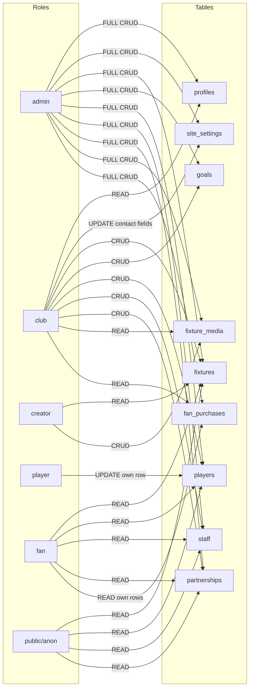

# Auth & Role-Based Access Plan

## Overview

Extend the existing Supabase schema with 5 user roles, new tables, and granular RLS policies.

## Roles

| Role | Description | Access Level |
|------|-------------|-------------|
| **admin** | Full system access | CRUD on ALL tables, manage users |
| **club** | Club staff managing content | CRUD on fixtures, players, staff, partnerships, site_settings contact fields |
| **creator** | Content creators | CRUD on fixture_media only - video preview links |
| **player** | Individual players | UPDATE own player row only - linked via user_id |
| **fan** | Registered fans | Read public data + own purchase history |

## New Tables

### 1. `partnerships`
For club users to manage sponsors/partners displayed on the site.

```sql
create table public.partnerships (
  id uuid primary key default gen_random_uuid(),
  name text not null,
  description text,
  logo_url text,
  website_url text,
  tier text check (tier in ('platinum', 'gold', 'silver', 'bronze')),
  is_active boolean not null default true,
  created_at timestamptz not null default now(),
  updated_at timestamptz not null default now()
);
```

### 2. `fixture_media`
Separate table for creator video links - avoids column-level security complexity on fixtures.

```sql
create table public.fixture_media (
  id uuid primary key default gen_random_uuid(),
  fixture_id uuid not null references public.fixtures(id) on delete cascade,
  video_url text not null,
  title text,
  created_by uuid references auth.users(id),
  created_at timestamptz not null default now()
);
```

### 3. `fan_purchases`
Stores purchase records from Stripe webhooks for fan tracking.

```sql
create table public.fan_purchases (
  id uuid primary key default gen_random_uuid(),
  user_id uuid not null references auth.users(id) on delete cascade,
  stripe_session_id text not null unique,
  purchase_type text not null check (purchase_type in ('ticket', 'merch')),
  description text,
  amount_cents integer not null,
  currency text not null default 'gbp',
  status text not null default 'pending' check (status in ('pending', 'completed', 'refunded')),
  metadata jsonb,
  created_at timestamptz not null default now()
);
```

## Modified Tables

### `profiles` - Update role constraint
```sql
-- Change from ('owner', 'admin', 'editor') to:
check (role in ('admin', 'club', 'creator', 'player', 'fan'))
```

### `players` - Add user_id for self-editing
```sql
alter table public.players add column user_id uuid references auth.users(id);
```

## Auth Trigger: Auto-create profile on signup

```sql
create function public.handle_new_user()
returns trigger
language plpgsql
security definer set search_path = ''
as $$
begin
  insert into public.profiles (id, full_name, role)
  values (
    new.id,
    coalesce(new.raw_user_meta_data->>'full_name', ''),
    'fan'
  );
  return new;
end;
$$;

create trigger on_auth_user_created
  after insert on auth.users
  for each row execute procedure public.handle_new_user();
```

Default role for new signups: **fan**. Admins can promote users to other roles via the admin panel.

## RLS Policy Matrix



## Detailed RLS Policies

### Helper Functions
```sql
-- Replace existing has_editor_access with role-specific functions
create function public.has_role(text)
returns boolean
language sql stable set search_path = ''
as $$
  select exists (
    select 1 from public.profiles
    where id = auth.uid() and role = $1
  );
$$;

create function public.is_admin()
returns boolean language sql stable set search_path = ''
as $$ select public.has_role('admin'); $$;

create function public.is_club()
returns boolean language sql stable set search_path = ''
as $$ select public.has_role('admin') or public.has_role('club'); $$;

create function public.is_creator()
returns boolean language sql stable set search_path = ''
as $$ select public.has_role('admin') or public.has_role('creator'); $$;
```

### Per-Table Policies

| Table | Policy | Using |
|-------|--------|-------|
| **profiles** | Public read | `true` |
| **profiles** | Admin manage | `is_admin()` |
| **site_settings** | Public read | `true` |
| **site_settings** | Admin full | `is_admin()` |
| **site_settings** | Club update contact | `is_club()` + column-level restriction |
| **fixtures** | Public read | `true` |
| **fixtures** | Admin full | `is_admin()` |
| **fixtures** | Club CRUD | `is_club()` |
| **goals** | Public read | `true` |
| **goals** | Admin full | `is_admin()` |
| **goals** | Club CRUD | `is_club()` |
| **players** | Public read | `true` |
| **players** | Admin full | `is_admin()` |
| **players** | Club CRUD | `is_club()` |
| **players** | Player self-update | `user_id = auth.uid()` |
| **staff** | Public read | `true` |
| **staff** | Admin full | `is_admin()` |
| **staff** | Club CRUD | `is_club()` |
| **partnerships** | Public read | `true` |
| **partnerships** | Admin full | `is_admin()` |
| **partnerships** | Club CRUD | `is_club()` |
| **fixture_media** | Public read | `true` |
| **fixture_media** | Admin full | `is_admin()` |
| **fixture_media** | Creator CRUD | `is_creator()` |
| **fan_purchases** | Fan own reads | `user_id = auth.uid()` |
| **fan_purchases** | Admin full | `is_admin()` |

### Club site_settings restriction
Club users can only update contact fields in site_settings. This uses column-level UPDATE privilege:
```sql
revoke update on table public.site_settings from authenticated;
grant update (contact_email, contact_phone, stadium_name) on table public.site_settings to authenticated;
```
Combined with an RLS policy that checks `is_club()`.

## Tickets & Merch Strategy

- **Stripe Checkout** handles all payment flows
- A Supabase Edge Function receives Stripe webhooks and writes to `fan_purchases`
- No need for ticket/merch inventory tables in Supabase
- The frontend renders ticket/merch pages from static config or CMS data
- Purchase history is tracked per-fan in `fan_purchases`

## Migration Order

1. Drop existing RLS policies and `has_editor_access` function
2. Update `profiles.role` check constraint
3. Add `user_id` to `players`
4. Create `partnerships`, `fixture_media`, `fan_purchases` tables
5. Create helper functions: `has_role`, `is_admin`, `is_club`, `is_creator`
6. Enable RLS on new tables
7. Create all new role-specific RLS policies
8. Add column-level restriction for club on site_settings
9. Create `handle_new_user` trigger
10. Update `src/types/database.ts` to match
