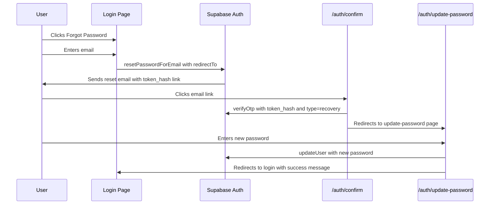

# Password Reset Feature Plan

## Context

Your admin account was found:
- **Email:** `cryptosi@protonmail.com`
- **Role:** admin
- **Project:** afroballconnect (Supabase, eu-west-1)

The login page at `/login` currently has no password reset functionality. This plan adds a complete "Forgot Password" flow using Supabase's PKCE-based password reset.

## Architecture

The project uses `@supabase/ssr` with Next.js middleware, which means it uses the **PKCE flow** for auth. The password reset flow has three stages:



## Files to Create/Modify

### 1. Modify `src/app/login/page.tsx`

Add a **Forgot Password?** link below the password field and a **reset mode** to the login form:

- Add a `resetMode` state toggle
- In reset mode, show only an email input and "Send Reset Link" button
- Call `supabase.auth.resetPasswordForEmail(email, { redirectTo: '<site_url>/auth/update-password' })`
- Show success message: "Check your email for a password reset link"
- Add "Back to Sign In" link to return to login mode

### 2. Create `src/app/auth/confirm/route.ts`

Server-side GET endpoint that handles the PKCE token exchange from the email link:

- Extract `token_hash` and `type` from URL search params
- Create a Supabase server client using `@supabase/ssr` with cookie handling
- Call `supabase.auth.verifyOtp({ type, token_hash })`
- On success: redirect to `/auth/update-password`
- On failure: redirect to `/login?error=reset_failed`

### 3. Create `src/app/auth/update-password/page.tsx`

A client component page where the user sets their new password:

- Must be accessible only to users with a valid session (from the reset link)
- Show new password + confirm password fields
- Call `supabase.auth.updateUser({ password: newPassword })`
- On success: sign out, redirect to `/login?reset=success`
- On failure: show error message
- Use the same Navbar/Footer layout as the login page

### 4. Supabase Dashboard Configuration

These changes are made in the Supabase Dashboard, not in code:

#### a. Update Reset Password Email Template

Go to **Authentication > Email Templates > Reset Password** and update to PKCE format:

```html
<h2>Reset Password</h2>
<p>Follow this link to reset the password for your user:</p>
<p>
  <a href="{{ .SiteURL }}/auth/confirm?token_hash={{ .TokenHash }}&type=recovery&next=/auth/update-password">
    Reset Password
  </a>
</p>
```

#### b. Add Redirect URL

Go to **Authentication > URL Configuration > Redirect URLs** and add:
- `https://<your-site>/auth/update-password`

## Middleware Considerations

The existing middleware at `src/lib/supabase/middleware.ts`:
- Protects `/dashboard` — unauthenticated users redirected to `/login`
- Redirects authenticated users away from `/login` to `/dashboard`

The new routes `/auth/confirm` and `/auth/update-password` are **not affected** by these rules because:
- `/auth/confirm` is a server route (not a page), handled by Next.js route handler
- `/auth/update-password` does not start with `/dashboard` or equal `/login`

No middleware changes are needed.

## Implementation Order

1. Modify `src/app/login/page.tsx` — add forgot password UI
2. Create `src/app/auth/confirm/route.ts` — token exchange endpoint
3. Create `src/app/auth/update-password/page.tsx` — new password form
4. Configure Supabase dashboard — email template + redirect URLs
5. Test end-to-end flow
