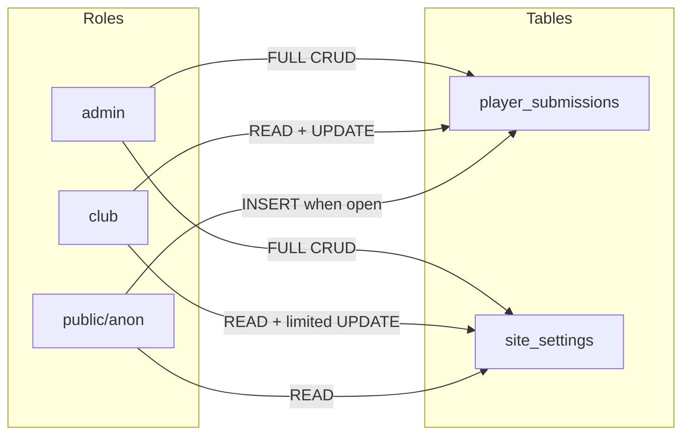
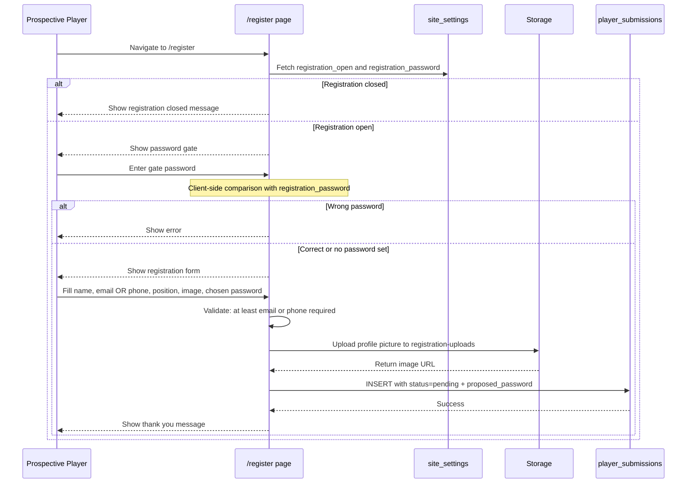
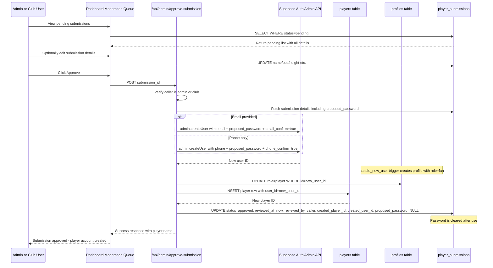
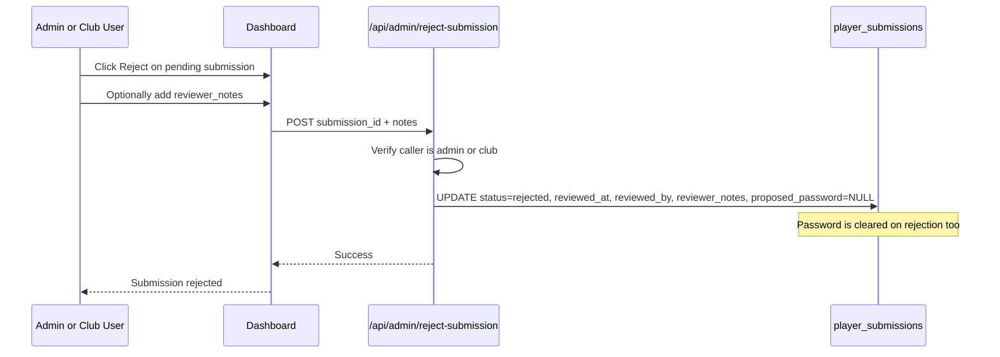

# Player Registration & Moderation System — Technical Plan

## Summary

Design and implement a role-based player registration and moderation system. Admin and Club Users can toggle a public registration page on/off and set a gate password. Prospective players submit details + profile picture + their chosen login credentials through this page. Submissions enter a **pending** state. Admin/Club Users review, edit, and approve/reject submissions via a dashboard moderation queue. On approval, the system auto-creates a Supabase Auth user using the player's chosen password and links the player profile. The architecture is extensible for future moderation-based features.

---

## Current State

### Already Built
- **Supabase project**: `bntpwgnwjkhtyczpmhqm` (afroballconnect, eu-west-1)
- **8 tables with RLS**: profiles, site_settings, fixtures, goals, players (has `user_id` column), staff, partnerships, fixture_media, fan_purchases
- **5 roles**: admin, club, creator, player, fan
- **RLS helpers**: `has_editor_access()`, `has_role()`, `is_admin()`
- **Auth trigger**: `handle_new_user()` — auto-creates profile with role=fan
- **Admin create-user API**: [`/api/admin/create-user/route.ts`](src/app/api/admin/create-user/route.ts) — uses service role key
- **Full dashboard**: [`dashboard-config.ts`](src/lib/dashboard-config.ts) with role-based sidebar sections

### What Needs Building
- Registration toggle + gate password in site_settings
- Public registration page at `/register` with password gate
- `player_submissions` table (moderation queue)
- Storage bucket for registration uploads
- Moderation UI in dashboard
- Approval/rejection API routes

---

## Architecture Overview

```mermaid
flowchart TB
    subgraph Public
        RP[Registration Page /register]
    end

    subgraph Dashboard - Admin and Club
        SS[Site Settings - Toggle + Gate Password]
        MQ[Submissions Moderation Queue]
    end

    subgraph Database
        SST[site_settings]
        PS[player_submissions]
        PL[players]
        PR[profiles]
        AU[auth.users]
    end

    subgraph Storage
        BU[registration-uploads bucket]
    end

    subgraph API
        AA[/api/admin/approve-submission]
        AR[/api/admin/reject-submission]
    end

    SS -->|toggle registration_open| SST
    SS -->|set registration_password| SST
    RP -->|check registration_open| SST
    RP -->|verify gate password client-side| SST
    RP -->|upload image| BU
    RP -->|submit form with chosen password| PS
    MQ -->|list pending| PS
    MQ -->|edit before approval| PS
    MQ -->|approve| AA
    MQ -->|reject| AR
    AA -->|create auth user with players chosen password| AU
    AA -->|update profile role to player| PR
    AA -->|create player row linked to user| PL
    AA -->|update status to approved| PS
    AR -->|update status to rejected| PS
```

---

## Phase 1: Database Schema Changes

### 1.1 ALTER `site_settings` — Add Registration Controls

```sql
ALTER TABLE public.site_settings
  ADD COLUMN IF NOT EXISTS registration_open boolean NOT NULL DEFAULT false,
  ADD COLUMN IF NOT EXISTS registration_password text;
```

| Column | Type | Default | Purpose |
|--------|------|---------|---------|
| `registration_open` | boolean | false | Toggle for the public registration page |
| `registration_password` | text | null | Gate password shared in-person. When null, no password required |

### 1.2 CREATE `player_submissions` — Moderation Queue

```sql
CREATE TABLE public.player_submissions (
  id uuid PRIMARY KEY DEFAULT gen_random_uuid(),
  -- Personal details
  name text NOT NULL,
  email text,
  phone text,
  pos text NOT NULL,
  second_pos text,
  height text,
  image_url text,
  squad_number integer,
  -- Auth credentials (player-chosen)
  proposed_password text NOT NULL,
  -- Moderation workflow
  status text NOT NULL DEFAULT 'pending'
    CHECK (status IN ('pending', 'approved', 'rejected')),
  submitted_at timestamptz NOT NULL DEFAULT now(),
  reviewed_at timestamptz,
  reviewed_by uuid REFERENCES auth.users(id),
  reviewer_notes text,
  -- Links created on approval
  created_player_id uuid REFERENCES public.players(id),
  created_user_id uuid REFERENCES auth.users(id),
  -- Constraints: at least email or phone must be provided
  CONSTRAINT contact_info_required CHECK (
    email IS NOT NULL OR phone IS NOT NULL
  )
);

ALTER TABLE public.player_submissions ENABLE ROW LEVEL SECURITY;
```

| Column | Type | Purpose |
|--------|------|---------|
| `id` | uuid | Primary key |
| `name` | text | Player full name |
| `email` | text | Email for auth account (nullable if phone provided) |
| `phone` | text | Phone for auth account (nullable if email provided) |
| `pos` | text | Primary position |
| `second_pos` | text | Secondary position (nullable) |
| `height` | text | Player height (nullable) |
| `image_url` | text | Profile picture URL from storage (nullable) |
| `squad_number` | integer | Preferred squad number (nullable) |
| `proposed_password` | text | Player-chosen password for their future auth account |
| `status` | text | pending / approved / rejected |
| `submitted_at` | timestamptz | When the player submitted |
| `reviewed_at` | timestamptz | When admin/club reviewed |
| `reviewed_by` | uuid | Which admin/club user reviewed |
| `reviewer_notes` | text | Optional notes from reviewer |
| `created_player_id` | uuid | FK to players table — set on approval |
| `created_user_id` | uuid | FK to auth.users — set on approval |

**Key design decisions:**
- `email` and `phone` are both nullable, but the CHECK constraint ensures at least one is provided
- `proposed_password` stores the player's chosen password in plain text — this is protected by RLS (only admin/club can read submissions) and is cleared after approval
- Supabase Auth supports both `signInWithPassword({ email, password })` and `signInWithPassword({ phone, password })` so players can log in with whichever identifier they provided

---

## Phase 2: Storage Bucket Setup

### 2.1 Create `registration-uploads` Bucket

```sql
INSERT INTO storage.buckets (id, name, public)
VALUES ('registration-uploads', 'registration-uploads', true);
```

The bucket is **public** so approved player images are visible on the public site without signed URLs.

### 2.2 Storage RLS Policies

```sql
-- Anyone can upload to registration-uploads (needed for the public form)
CREATE POLICY "Anyone can upload registration images"
  ON storage.objects FOR INSERT
  WITH CHECK (bucket_id = 'registration-uploads');

-- Public read for all images in the bucket
CREATE POLICY "Public read registration images"
  ON storage.objects FOR SELECT
  USING (bucket_id = 'registration-uploads');

-- Admin and Club can delete (e.g., removing inappropriate images)
CREATE POLICY "Admin and Club can manage registration images"
  ON storage.objects FOR ALL
  USING (
    bucket_id = 'registration-uploads'
    AND public.is_admin_or_club()
  );
```

**Path structure**: `submissions/{submission_id}/{filename}`

---

## Phase 3: RLS Policies

### 3.1 Helper Function

```sql
CREATE OR REPLACE FUNCTION public.is_admin_or_club()
RETURNS boolean
LANGUAGE sql STABLE SET search_path = ''
AS $$
  SELECT EXISTS (
    SELECT 1 FROM public.profiles
    WHERE id = auth.uid() AND role IN ('admin', 'club')
  );
$$;
```

### 3.2 `player_submissions` Policies

```sql
-- Anon/public can INSERT only when registration is open
-- They can only create pending submissions
CREATE POLICY "Public submit when registration open"
  ON public.player_submissions FOR INSERT
  WITH CHECK (
    status = 'pending'
    AND EXISTS (
      SELECT 1 FROM public.site_settings
      WHERE registration_open = true
    )
  );

-- Admin and Club can read all submissions
CREATE POLICY "Admin and Club read submissions"
  ON public.player_submissions FOR SELECT
  USING (public.is_admin_or_club());

-- Admin and Club can update (review/approve/reject/edit)
CREATE POLICY "Admin and Club manage submissions"
  ON public.player_submissions FOR UPDATE
  USING (public.is_admin_or_club())
  WITH CHECK (public.is_admin_or_club());

-- No one can delete submissions (audit trail)
-- If needed, only admin can delete via service role
```

### 3.3 RLS Policy Matrix



---

## Phase 4: Complete Data Flow

### 4.1 Registration Flow



### 4.2 Moderation and Approval Flow



### 4.3 Rejection Flow



---

## Phase 5: Frontend Changes

### 5.1 NEW: `src/app/register/page.tsx` — Public Registration Page

**Behaviour:**
1. Fetches `site_settings` to check `registration_open`
2. If closed → shows "Registration is currently closed" message
3. If open → shows password gate form
4. User enters gate password → compared client-side against `registration_password` from site_settings
5. If correct → reveals full registration form
6. Form fields:
   - **Name** (required)
   - **Email** (optional if phone provided)
   - **Phone** (optional if email provided)
   - **Position** (required, dropdown)
   - **Second Position** (optional)
   - **Height** (optional)
   - **Squad Number** (optional)
   - **Profile Picture** (optional, upload)
   - **Choose Password** (required, min 6 chars)
   - **Confirm Password** (required, must match)
7. On submit: uploads image to `registration-uploads` bucket, then inserts into `player_submissions`
8. Shows success/thank you screen

**Key implementation notes:**
- Uses anon-key Supabase client (no auth required)
- Image upload uses `supabase.storage.from('registration-uploads').upload()`
- Gate password comparison is client-side (the password is read from site_settings which is publicly readable — this is acceptable as it's a simple gate, not a security boundary)
- Position dropdown should match existing positions used in the players table
- Validation ensures at least email OR phone is provided
- The `proposed_password` is included in the INSERT but is protected by RLS

### 5.2 NEW: `src/app/dashboard/components/submissions-section.tsx` — Moderation Queue

**Behaviour:**
1. Tabs: Pending / Approved / Rejected
2. Pending tab shows cards with submission details + profile picture
3. Each card has: Edit, Approve, Reject buttons
4. Edit opens a dialog to modify name, position, height, etc. before approval
5. Approve calls `/api/admin/approve-submission`
6. Reject calls `/api/admin/reject-submission` with optional notes
7. Approved/Rejected tabs show history with reviewer info
8. Does NOT display the proposed_password to the moderator (it's used server-side only)

### 5.3 MODIFY: `src/lib/dashboard-config.ts`

Add new sidebar item:

```typescript
{
  id: "submissions",
  label: "Player Submissions",
  icon: UserPlus, // from lucide-react
  roles: ["admin", "club"],
  crudRoles: ["admin", "club"],
}
```

Add `"submissions"` to the `SectionId` union type.

### 5.4 MODIFY: `src/app/dashboard/components/site-settings-section.tsx`

Add two new fields:
- **Registration Open**: Switch/toggle component
- **Registration Password**: Text input (with show/hide toggle)

Both save to `site_settings.registration_open` and `site_settings.registration_password`.

### 5.5 NEW: `src/app/api/admin/approve-submission/route.ts`

Server-side API route that:
1. Verifies caller is admin or club (same pattern as existing [`create-user/route.ts`](src/app/api/admin/create-user/route.ts))
2. Fetches the submission by ID (using service role client to get `proposed_password`)
3. Validates submission is in `pending` status
4. Creates auth user via `admin.createUser()`:
   - If email provided: `{ email, password: proposed_password, email_confirm: true }`
   - If phone only: `{ phone, password: proposed_password, phone_confirm: true }`
5. Updates profile role to `player`
6. Creates player row with submission data + `user_id` link
7. Updates submission: `status='approved'`, `reviewed_at`, `reviewed_by`, `created_player_id`, `created_user_id`, `proposed_password=NULL`
8. Returns success with player name and identifier (email or phone)

### 5.6 NEW: `src/app/api/admin/reject-submission/route.ts`

Server-side API route that:
1. Verifies caller is admin or club
2. Fetches the submission by ID
3. Validates submission is in `pending` status
4. Updates submission: `status='rejected'`, `reviewed_at`, `reviewed_by`, `reviewer_notes`, `proposed_password=NULL`
5. Returns success

### 5.7 MODIFY: `src/types/database.ts`

Add type definitions for `player_submissions` table matching the schema above.

### 5.8 MODIFY: `middleware.ts`

The existing middleware already allows public access to all routes except `/dashboard`. The `/register` route will work for anon users by default since the middleware only protects `/dashboard` and redirects `/admin` → `/dashboard`. **No changes needed.**

---

## Phase 6: Security Considerations

| Concern | Mitigation |
|---------|------------|
| Gate password exposed in client | Password is stored in `site_settings` (publicly readable) and compared client-side. This is acceptable because the password is shared in-person and acts as a simple gate. The real security is the moderation queue — no submission becomes a player without admin/club approval. |
| Player password stored in DB | `proposed_password` is stored temporarily in `player_submissions`, protected by RLS (only admin/club can read). It is cleared (set to NULL) immediately after approval or rejection. The moderation UI intentionally does NOT display it. |
| Spam submissions | The gate password significantly reduces spam. Rate limiting can be added via middleware later. All submissions are pending until approved. |
| Service role key exposure | Approval API route uses service role key server-side only, same pattern as existing [`create-user/route.ts`](src/app/api/admin/create-user/route.ts). |
| Inappropriate images | Admin/Club can delete images from storage during review. Storage policies allow admin/club to manage all objects. |
| Audit trail | Submissions are never deleted, only status-changed. `reviewed_by` and `reviewed_at` provide full accountability. |
| Player gets wrong role | Approval API explicitly sets `role='player'` on the profile, overriding the default `fan` from the trigger. |
| Players without email | Phone + password auth is fully supported by Supabase Auth. The `signInWithPassword({ phone, password })` method works identically to email login. |

---

## Phase 7: Login Experience for Approved Players

After approval, players can log in at `/login` using:

| Identifier Type | Login Method |
|----------------|-------------|
| Email provided | `signInWithPassword({ email, chosen_password })` |
| Phone only | `signInWithPassword({ phone, chosen_password })` |

The existing login page will need a minor update to support phone-based login (add a toggle or auto-detect whether the input is an email or phone number).

---

## Migration SQL — Complete

All database changes applied as a single Supabase migration:

```sql
-- 1. Add registration controls to site_settings
ALTER TABLE public.site_settings
  ADD COLUMN IF NOT EXISTS registration_open boolean NOT NULL DEFAULT false,
  ADD COLUMN IF NOT EXISTS registration_password text;

-- 2. Create player_submissions table
CREATE TABLE public.player_submissions (
  id uuid PRIMARY KEY DEFAULT gen_random_uuid(),
  name text NOT NULL,
  email text,
  phone text,
  pos text NOT NULL,
  second_pos text,
  height text,
  image_url text,
  squad_number integer,
  proposed_password text NOT NULL,
  status text NOT NULL DEFAULT 'pending'
    CHECK (status IN ('pending', 'approved', 'rejected')),
  submitted_at timestamptz NOT NULL DEFAULT now(),
  reviewed_at timestamptz,
  reviewed_by uuid REFERENCES auth.users(id),
  reviewer_notes text,
  created_player_id uuid REFERENCES public.players(id),
  created_user_id uuid REFERENCES auth.users(id),
  CONSTRAINT contact_info_required CHECK (
    email IS NOT NULL OR phone IS NOT NULL
  )
);

ALTER TABLE public.player_submissions ENABLE ROW LEVEL SECURITY;

-- 3. Create helper function
CREATE OR REPLACE FUNCTION public.is_admin_or_club()
RETURNS boolean
LANGUAGE sql STABLE SET search_path = ''
AS $$
  SELECT EXISTS (
    SELECT 1 FROM public.profiles
    WHERE id = auth.uid() AND role IN ('admin', 'club')
  );
$$;

-- 4. RLS policies for player_submissions
CREATE POLICY "Public submit when registration open"
  ON public.player_submissions FOR INSERT
  WITH CHECK (
    status = 'pending'
    AND EXISTS (
      SELECT 1 FROM public.site_settings
      WHERE registration_open = true
    )
  );

CREATE POLICY "Admin and Club read submissions"
  ON public.player_submissions FOR SELECT
  USING (public.is_admin_or_club());

CREATE POLICY "Admin and Club manage submissions"
  ON public.player_submissions FOR UPDATE
  USING (public.is_admin_or_club())
  WITH CHECK (public.is_admin_or_club());

-- 5. Create storage bucket
INSERT INTO storage.buckets (id, name, public)
VALUES ('registration-uploads', 'registration-uploads', true)
ON CONFLICT (id) DO NOTHING;

-- 6. Storage RLS policies
CREATE POLICY "Anyone can upload registration images"
  ON storage.objects FOR INSERT
  WITH CHECK (bucket_id = 'registration-uploads');

CREATE POLICY "Public read registration images"
  ON storage.objects FOR SELECT
  USING (bucket_id = 'registration-uploads');

CREATE POLICY "Admin and Club can manage registration images"
  ON storage.objects FOR ALL
  USING (
    bucket_id = 'registration-uploads'
    AND public.is_admin_or_club()
  );
```

---

## File Change Summary

| Action | File | Description |
|--------|------|-------------|
| CREATE | `src/app/register/page.tsx` | Public registration page with gate password + player-chosen password |
| CREATE | `src/app/dashboard/components/submissions-section.tsx` | Moderation queue UI with pending/approved/rejected tabs |
| CREATE | `src/app/api/admin/approve-submission/route.ts` | Approval API — creates auth user + player row |
| CREATE | `src/app/api/admin/reject-submission/route.ts` | Rejection API — updates status + clears password |
| MODIFY | `src/lib/dashboard-config.ts` | Add submissions sidebar item + SectionId |
| MODIFY | `src/app/dashboard/components/site-settings-section.tsx` | Add registration toggle + gate password fields |
| MODIFY | `src/app/dashboard/page.tsx` | Wire up submissions section |
| MODIFY | `src/types/database.ts` | Add player_submissions type definitions |
| MODIFY | `src/app/dashboard/dashboard-queries.ts` | Add queries for submissions |
| MODIFY | `src/app/dashboard/use-dashboard-data.ts` | Add submissions data loading |
| MODIFY | `src/app/dashboard/components/dashboard-sections.tsx` | Add submissions section render |
| MODIFY | `src/app/login/page.tsx` | Support phone-based login |
| APPLY | Supabase migration | All database + storage changes |
