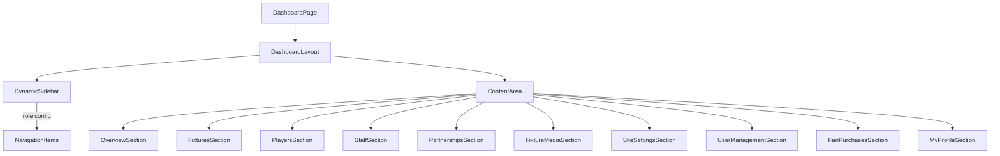

# Role-Based Dashboard Plan

## Overview

Replace the current single `/admin` page with a unified `/dashboard` route that dynamically renders sidebar navigation and content sections based on the authenticated user's role. All 5 roles share the same route but see different sections.

## Roles Recap

| Role | Description | Default on Signup |
|------|-------------|-------------------|
| **admin** | Full system access | No — promoted by existing admin |
| **club** | Club staff managing content | No — promoted by admin |
| **creator** | Content creators — video links | No — promoted by admin |
| **player** | Individual players | No — promoted by admin |
| **fan** | Registered fans | **Yes** — default role |

---

## Dashboard Overview Cards — Per Role

Each role lands on an overview page with different KPI widgets:

### Admin Overview
- Total registered users by role
- Total fixtures — upcoming vs completed
- Active players / Active staff count
- Active partnerships by tier
- Recent fan purchases — all users
- Pending purchases needing attention

### Club Overview
- Upcoming fixtures count + next match card
- Active players / Active staff count
- Active partnerships count
- Quick-add buttons for fixtures, players, staff

### Creator Overview
- Total media items uploaded
- Fixtures missing media — count + list
- Recent uploads — last 5 items
- Quick-add button for new media

### Player Overview
- Personal profile card — name, position, squad number, image
- Next upcoming match card
- Recent match results — last 3
- Team stats — wins/losses/draws

### Fan Overview
- Upcoming fixtures — next 3 matches
- Own purchase history — recent tickets and merch
- Active partnerships/sponsors display
- Quick links to tickets and merch pages

---

## Sidebar Sections — Visibility Matrix

Legend: **CRUD** = full create/read/update/delete, **Read** = view-only, **Edit** = limited edit, **Own** = own data only, ❌ = hidden

| Sidebar Section | admin | club | creator | player | fan |
|-----------------|-------|------|---------|--------|-----|
| **Overview** | ✅ | ✅ | ✅ | ✅ | ✅ |
| **Fixtures & Results** | CRUD | CRUD | Read | Read | Read |
| **First Team Squad** | CRUD | CRUD | ❌ | ❌ | Read |
| **Leadership & Staff** | CRUD | CRUD | ❌ | ❌ | Read |
| **Partnerships** | CRUD | CRUD | ❌ | Read | Read |
| **Fixture Media** | CRUD | Read | CRUD | ❌ | ❌ |
| **Site Settings** | Full edit | Contact only | ❌ | ❌ | ❌ |
| **User Management** | CRUD | ❌ | ❌ | ❌ | ❌ |
| **Fan Purchases** | Read all | ❌ | ❌ | ❌ | Own only |
| **My Profile** | ❌ | ❌ | ❌ | Edit own | ❌ |

---

## Detailed Section Breakdown

### 1. Fixtures & Results

**admin / club** — Full CRUD:
- Add new fixture — opponent, date, time, venue
- Submit match result — scores + goal scorers via `submit_match_result` RPC
- Delete fixture
- Table with all fixtures sorted by date

**creator** — Read-only:
- View fixture list — to know which fixtures exist for attaching media
- No add/edit/delete buttons

**player / fan** — Read-only:
- View fixture list and results
- No action buttons

### 2. First Team Squad

**admin / club** — Full CRUD:
- Add player — name, position, second position, height, image URL, squad number
- Edit player details
- Deactivate player — set `is_active = false`
- Table of active players

**fan** — Read-only:
- View player roster
- No action buttons

**creator / player** — Hidden from sidebar entirely

### 3. Leadership & Staff

**admin / club** — Full CRUD:
- Add staff member — name, role, bio, image URL
- Edit staff details
- Deactivate staff — set `is_active = false`
- Table of active staff

**fan** — Read-only:
- View staff directory
- No action buttons

**creator / player** — Hidden from sidebar entirely

### 4. Partnerships

**admin / club** — Full CRUD:
- Add partner — name, description, logo URL, website URL, tier
- Edit partner details
- Toggle `is_active`
- Table of all partnerships

**player / fan** — Read-only:
- View active partnerships
- No action buttons

**creator** — Hidden from sidebar entirely

### 5. Fixture Media

**admin / creator** — Full CRUD:
- Add video link — select fixture, enter video URL, title
- Edit media entry
- Delete media entry
- Table of all fixture media with fixture opponent context

**club** — Read-only:
- View media entries
- No add/edit/delete buttons

**player / fan** — Hidden from sidebar entirely

### 6. Site Settings

**admin** — Full edit:
- Edit all fields: club_name, short_name, primary_color, accent_color, stadium_name, contact_email, contact_phone

**club** — Contact-only edit:
- Edit only: contact_email, contact_phone, stadium_name
- Other fields shown as read-only

**creator / player / fan** — Hidden from sidebar entirely

### 7. User Management

**admin** — Full CRUD:
- View all registered users with their roles
- Change user role — promote/demote between admin/club/creator/player/fan
- Deactivate users — set role or revoke access
- Table of all profiles

**club / creator / player / fan** — Hidden from sidebar entirely

### 8. Fan Purchases

**admin** — Read all:
- View all purchase records across all fans
- Filter by status — pending/completed/refunded
- Filter by type — ticket/merch
- Table with user email, purchase type, amount, status, date

**fan** — Own only:
- View own purchase history
- Filter by status and type
- No access to other fans' data

**club / creator / player** — Hidden from sidebar entirely

### 9. My Profile — Player Only

**player** — Edit own row:
- Edit own player record linked via `user_id`
- Fields: name, position, second_pos, height, image_url
- Squad number shown as read-only — only club/admin can change it
- `is_active` shown as read-only badge

**All other roles** — Hidden from sidebar — admins manage profiles via User Management

---

## Routing & Navigation Flow

```mermaid
graph TD
    LOGIN[/login] -->|Auth success| ROLE_CHECK{Fetch role from profiles}
    ROLE_CHECK -->|admin| DASHBOARD[/dashboard]
    ROLE_CHECK -->|club| DASHBOARD
    ROLE_CHECK -->|creator| DASHBOARD
    ROLE_CHECK -->|player| DASHBOARD
    ROLE_CHECK -->|fan| DASHBOARD
    ROLE_CHECK -->|no role| LOGIN

    DASHBOARD --> SIDEBAR[Dynamic Sidebar]
    SIDEBAR -->|admin| ADMIN_SECTIONS[All sections visible]
    SIDEBAR -->|club| CLUB_SECTIONS[Fixtures + Players + Staff + Partnerships + Media read + Contact settings]
    SIDEBAR -->|creator| CREATOR_SECTIONS[Fixture Media CRUD + Fixtures read]
    SIDEBAR -->|player| PLAYER_SECTIONS[My Profile + Fixtures read + Partnerships read]
    SIDEBAR -->|fan| FAN_SECTIONS[Purchases + Fixtures read + Players read + Staff read + Partnerships read]
```

### Middleware Changes

The existing middleware in `src/lib/supabase/middleware.ts` needs to:
1. Protect `/dashboard` — require authentication
2. Keep `/admin` as a redirect to `/dashboard` for backward compatibility
3. After login, redirect to `/dashboard` instead of `/admin`

### Login Redirect Update

In `src/app/login/page.tsx`:
- Change post-login redirect from `/admin` to `/dashboard`
- Change session-check redirect from `/admin` to `/dashboard`

---

## Component Architecture



### File Structure

```
src/app/dashboard/
  page.tsx                    — Main dashboard page with role check
  layout.tsx                  — Shared layout with sidebar
  components/
    dashboard-sidebar.tsx     — Role-aware sidebar navigation
    overview-admin.tsx        — Admin KPI cards
    overview-club.tsx         — Club KPI cards
    overview-creator.tsx      — Creator KPI cards
    overview-player.tsx       — Player KPI cards
    overview-fan.tsx          — Fan KPI cards
    fixtures-section.tsx      — Fixtures CRUD/read section
    players-section.tsx       — Players CRUD/read section
    staff-section.tsx         — Staff CRUD/read section
    partnerships-section.tsx  — Partnerships CRUD/read section
    fixture-media-section.tsx — Fixture media CRUD/read section
    site-settings-section.tsx — Site settings edit section
    user-management-section.tsx — User role management
    fan-purchases-section.tsx — Purchase history section
    my-profile-section.tsx    — Player self-edit section
  hooks/
    use-user-role.ts          — Hook to fetch and cache user role
    use-dashboard-data.ts     — Hook for dashboard data fetching
```

### Role Config Pattern

```typescript
// Example of how sidebar items are filtered
type SidebarItem = {
  id: string;
  label: string;
  icon: LucideIcon;
  roles: Array<'admin' | 'club' | 'creator' | 'player' | 'fan'>;
};

const SIDEBAR_ITEMS: SidebarItem[] = [
  { id: 'overview', label: 'Overview', icon: LayoutDashboard, roles: ['admin', 'club', 'creator', 'player', 'fan'] },
  { id: 'fixtures', label: 'Fixtures & Results', icon: Calendar, roles: ['admin', 'club', 'creator', 'player', 'fan'] },
  { id: 'players', label: 'First Team Squad', icon: Users, roles: ['admin', 'club', 'fan'] },
  { id: 'staff', label: 'Leadership & Staff', icon: ShieldCheck, roles: ['admin', 'club', 'fan'] },
  { id: 'partnerships', label: 'Partnerships', icon: Heart, roles: ['admin', 'club', 'player', 'fan'] },
  { id: 'fixture-media', label: 'Fixture Media', icon: Video, roles: ['admin', 'club', 'creator'] },
  { id: 'settings', label: 'Site Settings', icon: Settings, roles: ['admin', 'club'] },
  { id: 'users', label: 'User Management', icon: UserCog, roles: ['admin'] },
  { id: 'purchases', label: 'Fan Purchases', icon: ShoppingCart, roles: ['admin', 'fan'] },
  { id: 'my-profile', label: 'My Profile', icon: User, roles: ['player'] },
];
```

---

## Confirmed Decisions

1. **Route**: ✅ Single `/dashboard` route for ALL roles — admin included
2. **Admin page**: ✅ Refactor existing `/admin` page (~48K chars) into modular components under `/dashboard`
3. **Fan dashboard**: ✅ Full dashboard experience with sidebar navigation for fans
4. **Player profile**: ✅ Players can edit their own image URL along with other profile fields

### Migration Notes

- `/admin` route will redirect to `/dashboard` for backward compatibility
- Existing admin page functionality will be extracted into reusable section components
- The monolithic `src/app/admin/page.tsx` will be decomposed into the component structure defined above
